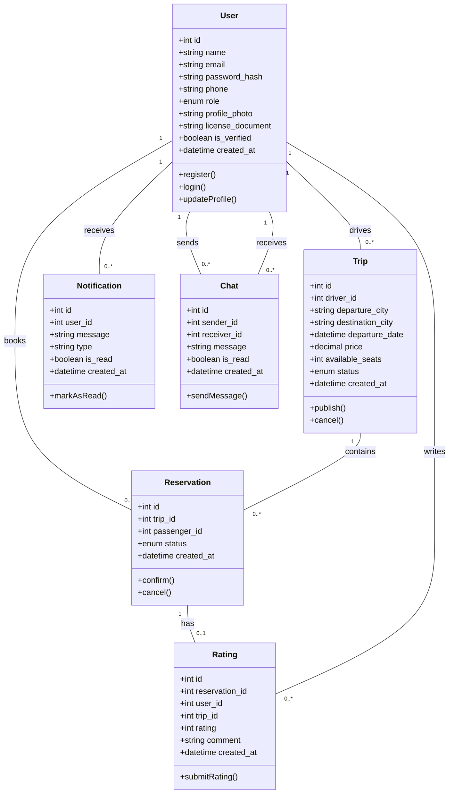

# TripShare Class Diagram

## Introduction
This document represents the data model and entity relationships for the TripShare application, based on the database schema.

## Class Diagram

```mermaid
classDiagram
    class User {
        +int id
        +string name
        +string email
        +string password_hash
        +string phone
        +enum role
        +string profile_photo
        +string license_document
        +boolean is_verified
        +datetime created_at
        +register()
        +login()
        +updateProfile()
    }

    class Trip {
        +int id
        +int driver_id
        +string departure_city
        +string destination_city
        +datetime departure_date
        +decimal price
        +int available_seats
        +enum status
        +datetime created_at
        +publish()
        +cancel()
    }

    class Reservation {
        +int id
        +int trip_id
        +int passenger_id
        +enum status
        +datetime created_at
        +confirm()
        +cancel()
    }

    class Notification {
        +int id
        +int user_id
        +string message
        +string type
        +boolean is_read
        +datetime created_at
        +markAsRead()
    }

    class Chat {
        +int id
        +int sender_id
        +int receiver_id
        +string message
        +boolean is_read
        +datetime created_at
        +sendMessage()
    }

    class Rating {
        +int id
        +int reservation_id
        +int user_id
        +int trip_id
        +int rating
        +string comment
        +datetime created_at
        +submitRating()
    }

    User "1" -- "0..*" Trip : drives
    User "1" -- "0..*" Reservation : books
    Trip "1" -- "0..*" Reservation : contains
    User "1" -- "0..*" Notification : receives
    User "1" -- "0..*" Chat : sends
    User "1" -- "0..*" Chat : receives
    Reservation "1" -- "0..1" Rating : has
    User "1" -- "0..*" Rating : writes
```
