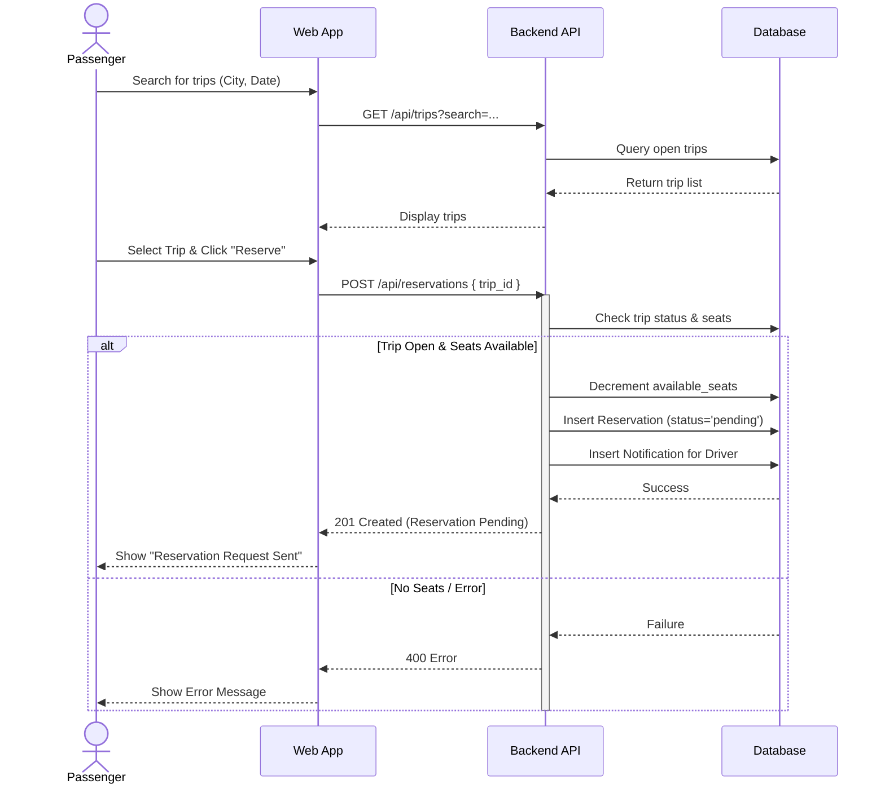
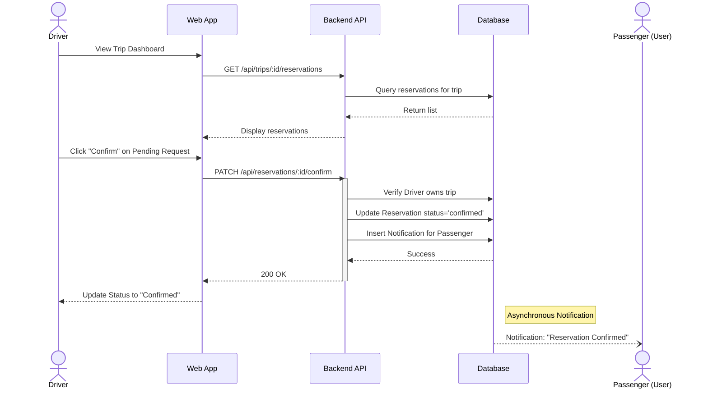
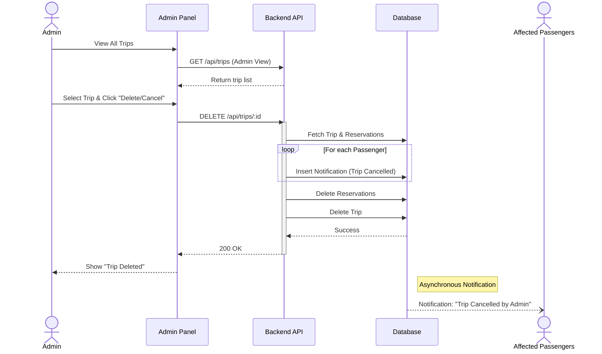

# TripShare Sequence Diagrams

## 1. Passenger: Reserve a Seat (Book Reservation)
This diagram illustrates the process of a passenger searching for a trip and making a reservation request.

## 2. Driver: Accept Reservation Request
This diagram shows the driver reviewing and confirming a pending reservation request from a passenger.

## 3. Admin: Cancel Trip (Moderation)
This diagram depicts an admin cancelling a trip, which triggers notifications to all affected passengers.

